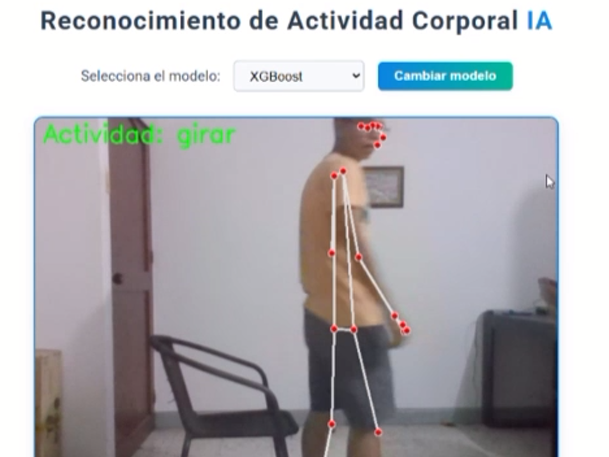
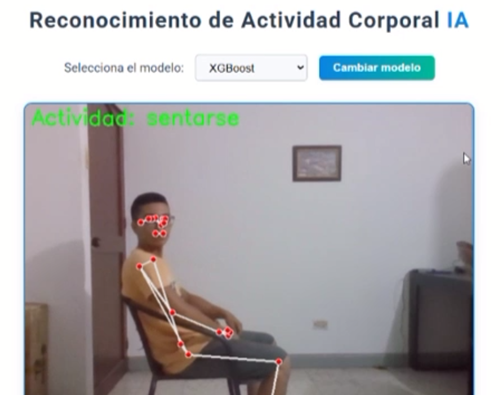

# Proyecto Final - Inteligencia Artificial I (2025-1)

  

**Universidad ICESI**

Ingeniería de Sistemas

  

## Integrantes

- Daron Mercado

- Santiago Arboleda

- Miguel Martínez

  

## 🎯 Objetivo

Desarrollar un sistema de software capaz de analizar y clasificar, en tiempo real, actividades humanas específicas (caminar hacia la cámara, caminar de regreso, girar, sentarse y ponerse de pie) mediante el seguimiento de movimientos articulares extraídos de video en vivo.

  

## 📥 Entradas

-  **Video en tiempo real** 

  

## 📤 Salidas

-  **Clasificación de actividad** en tiempo real (etiquetas: `walking_towards`, `walking_away`, `turning`, `sitting`, `standing_up`).

-  **Métricas posturales**: ángulos de rodilla, cadera y hombro.

-  **Streaming MJPEG** con overlay de landmarks y resultados.

  

## 🔧 Herramientas y Tecnologías

-  **MediaPipe Pose** para extracción de 33 landmarks articulares.

-  **Python 3.10**, **OpenCV**, **scikit-learn**, **XGBoost**.

-  **Flask** para API RESTful

-  **StandardScaler** e **Incremental PCA** para preprocesamiento en línea.

- Herramientas de anotación: **CVAT**, **LabelStudio**.

  

## 📂 Estructura del repositorio

Body_Recognition/

├─ data/ # Videos originales y frames extraídos

├─ notebooks/ # EDA y experimentos preliminares

├─ src/

│ ├─ acquisition.py # Captura de video y streaming

│ ├─ preprocessing.py # Filtrado, normalización y PCA

│ ├─ features.py # Cálculo de ángulos y features derivadas

│ ├─ train.py # Entrenamiento y validación de modelos

│ └─ app.py # Servidor Flask (/video_feed, /predict)

├─ models/ # Modelos serializados (.joblib)

├─ Dockerfile # Contenerización de la aplicación

├─ requirements.txt # Dependencias Python

└─ README.md # Documentación del proyecto

  

## 🚀 Metodología (CRISP-DM adaptado)

1.  **Comprensión del problema**

- Requisitos: accuracy ≥ 0.90, latencia < 100 ms, portabilidad.

- Revisión bibliográfica y definición de entregables semanales.

2.  **Recolección y Anotación de Datos**

- 80 clips (20 por actividad) grabados a 60 fps, fondo neutro e iluminación homogénea.

- Anotación de ventanas de N = 30 frames con etiquetas uniformes.

3.  **Extracción de Landmarks**

- MediaPipe Pose: 33 puntos 3D + visibilidad por fotograma.

- Suavizado exponencial y descarte de visibilidad < 0.5.

4.  **Generación de Features**

- Coordenadas normalizadas con StandardScaler.

- Cálculo de ángulos biomecánicos (rodilla, cadera).

5.  **Reducción de Dimensionalidad**

- PCA: 10 componentes principales (95 % varianza).

- Incremental PCA para escaneo en tiempo real.

6.  **Entrenamiento y Evaluación**

- Modelos: SVM, Random Forest, XGBoost con GridSearchCV.

- División 70/30 train-test, validación cruzada estratificada.

- Métricas: accuracy, precision, recall, F1-score.

7.  **Despliegue e Inferencia**

- API Flask con endpoints `/video_feed` (MJPEG) y `/predict` (JSON).

- Votación ponderada de modelos según F1-score.

- Docker para asegurar replicabilidad.

## 📺 Demo

<video controls width="640" poster="templates/demo/turn.png">
  <source src="templates/demo/demostration.mp4" type="video/mp4">
  Tu navegador no soporta reproducción de video.
</video>

▶️ Ver demostración en video

https://github.com/user-attachments/assets/a6d88c8c-8c68-47be-8255-a8db5b4a3abc

### 🎬 Capturas de pantalla

  
  

  

## 📊 Resultados Principales

| Modelo | Accuracy (test) | F1-macro |
|---------------|-----------------|----------|
| **SVM** | 88 % | 0.88 |
| **Random Forest** | 99% | 0.99 |
| **XGBoost** | 99% | 0.99 |

  

>  *El XGBoost mostró el mejor balance entre precisión y generalización en condiciones variables de captura.*

  

## 🔭 Trabajo Futuro

- Aumentar y diversificar el dataset (sujetos, escenarios, condiciones lumínicas).

- Evaluar arquitecturas LSTM/GRU para capturar dependencias temporales.

- Integrar sensores IMU para enriquecer datos de movimiento.

- Desplegar en edge devices (Jetson Nano, Raspberry Pi + TPU).

- Explorar aprendizaje continuo y adaptación de dominio.

  

## 🧪 Entregables

-  **Semana 12:** Metodología, métricas, EDA y estrategia de expansión de datos.

-  **Semana 14:** Preprocesamiento, PCA, entrenamiento inicial y resultados preliminares.

-  **Semana 17:** Sistema final desplegado, evaluación completa y video de presentación.

  

## 🔗 Enlaces

-  **Presentación:** https://drive.google.com/drive/folders/1AR6uxIySGLWzLHBRTTxHWf70CJF1OT5l

-  **Repositorio:** https://github.com/Ing-Daron11/Body_Recognition
